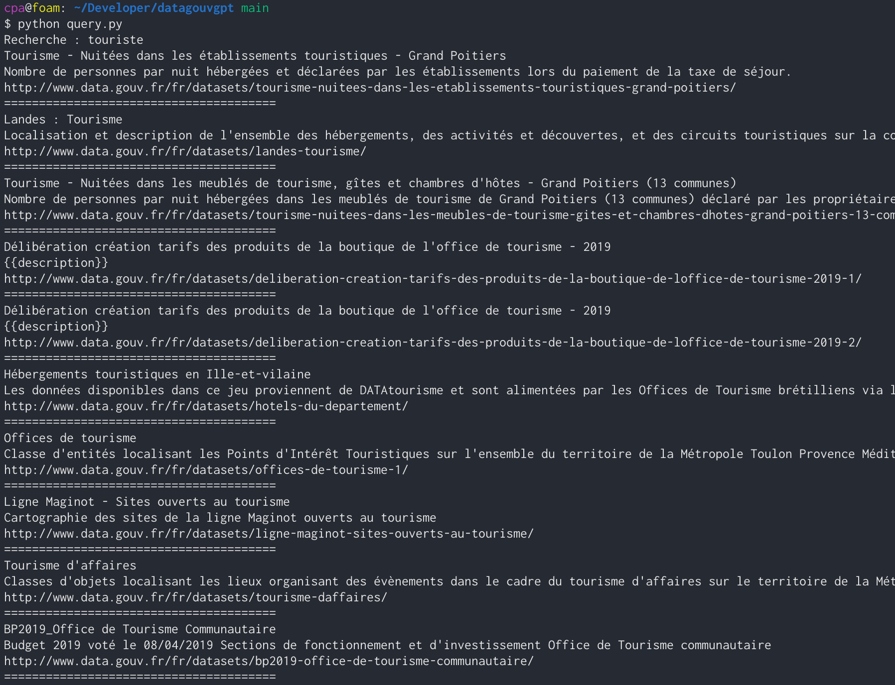

# Résumé

Ce repo permet de réaliser des recherches vectorielles (vector search) sur les titres et descriptions des [jeux de données](https://www.data.gouv.fr/fr/datasets/catalogue-des-donnees-de-data-gouv-fr/) présents sur data.gouv.fr.

La base d'embeddings doit être générée en lançant `load.py` une première fois (sur un ordinateur portable 4 cœurs, 2h30 avec l'embedding actuel).

Les requêtes se font avec `query.py`.

# Screenshot

